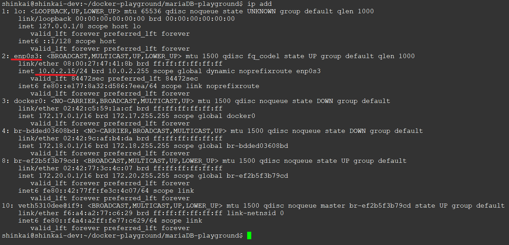
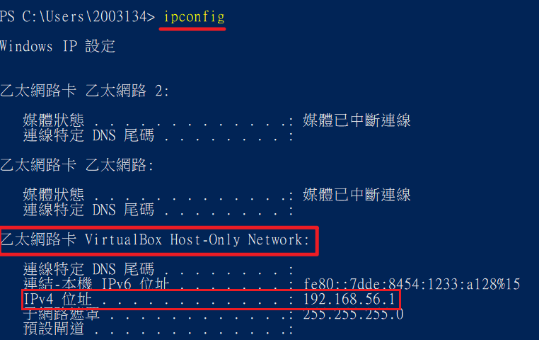
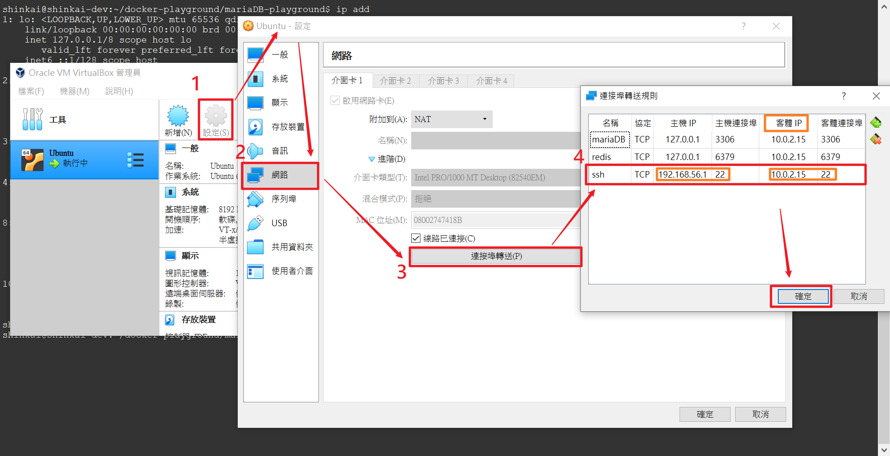
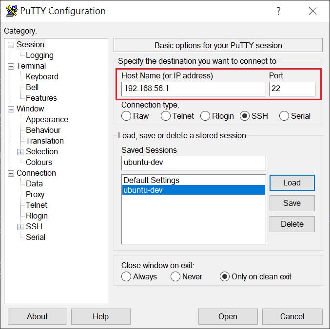

Linux安裝步驟
=======


## 使用VirtualBox ^6.0安裝Ubuntu 18.04
[安裝莊學]: https://murphymind.blogspot.com/2020/01/windows-virtualbox-ubuntu-1804.html
文章內安裝安裝 VirtualBox Guest Additions的部分可暫時略過不裝, 該用途為讓VirtualBox的視窗可以適配全螢幕, 支持雙向剪貼功能、共享目錄功能, 若需要用到GUI來操作Ubuntu的話建議安裝, 但後續開發上, 建議關掉Ubuntu的GUI(關閉方式後續安裝步驟說明會提到), 以減少資源的開銷(GUI會吃一些運算、I/O資源).

## 設置root的密碼
使用以下指令初始化root帳號(最高權限帳號)的密碼
```
$ sudo passwd root
```
輸入指令後, 會要求輸入2次欲設定的root密碼,
(本文章提供的指令若前綴帶有"$", 代表為linux指令)


## 更新Ubuntu核心套件
```
$ sudo apt update
$ sudo apt upgrade
```
(使用帶有sudo前綴指令, 可以以最高權限運行指令, 會要求輸入當下user的密碼)

## 安裝sssh
```
$ sudo apt-get install ssh
```
安裝ssh, 以利後續在關閉GUI的情況下, 使用putty遠端登入, 以下指令的方式進行後續開發

## 使用putty遠端連線
使用以下指令尋找VirtualBox中Ubuntu的IP位置
```
$ ip add
```

找出enp0s3網卡的IP位置


使用找出Windows(host端), 實際VirtualBox Host 的IP位置


打開VirtualBox管理介面, 將上述查詢到的port以下圖方式設定,將Ubuntu的 22 port 導到 Windows上, 主機IP填入實際VirtualBox Host 的IP位置, 客體IP填入Ubuntu虛擬機中, enp0s3網卡的IP位置



```
$ sudo systemctl set-default multi-user.target
```
關閉後, 使用以下指令重啟, 可關閉GUI

```
$ sudo reboot
```

若之後需要打開GUI, 則可以使用以下指令開啟GUI
```
$ sudo systemctl set-default graphical.target
```
一樣需要重啟才能開啟GUI

設定完成, 並關閉GUI後, 即可安裝putty, 使用putty遠端登入



## 安裝curl
```
$ sudo apt install curl
```
安裝curl, 以進行後續docker及docker-compose安裝

## 安裝docker
使用docker官方shell script安裝docker
```
$ sudo curl -sSL https://get.docker.com/ | sh
```

將docker服務設定為開機後自動開啟, 並初次手動開啟 (之後開機就不需要再重啟docker)
```
$ sudo systemctl enable docker
$ sudo systemctl start docker
```

確認是否安裝完成
```
$ sudo docker -v
```

## docker-compose安裝

使用docker官方shell script安裝docker-compose至/usr/local/bin/docker-compose 目錄下

```
sudo curl -L "https://github.com/docker/compose/releases/download/1.25.5/docker-compose-$(uname -s)-$(uname -m)" -o /usr/local/bin/docker-compose
```

將已安裝的docker-compose設定為可執行的檔案
```
sudo chmod +x /usr/local/bin/docker-compose
```

確認是否安裝完成
```
$ sudo docker-compose -v
```